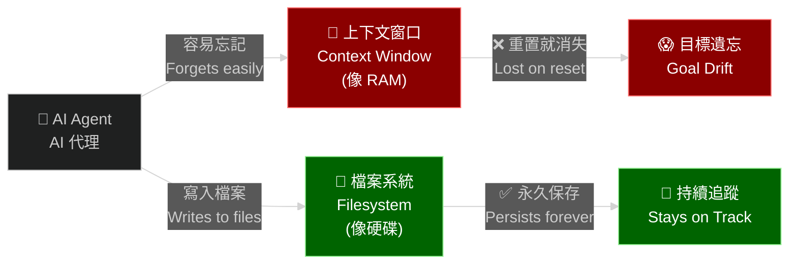
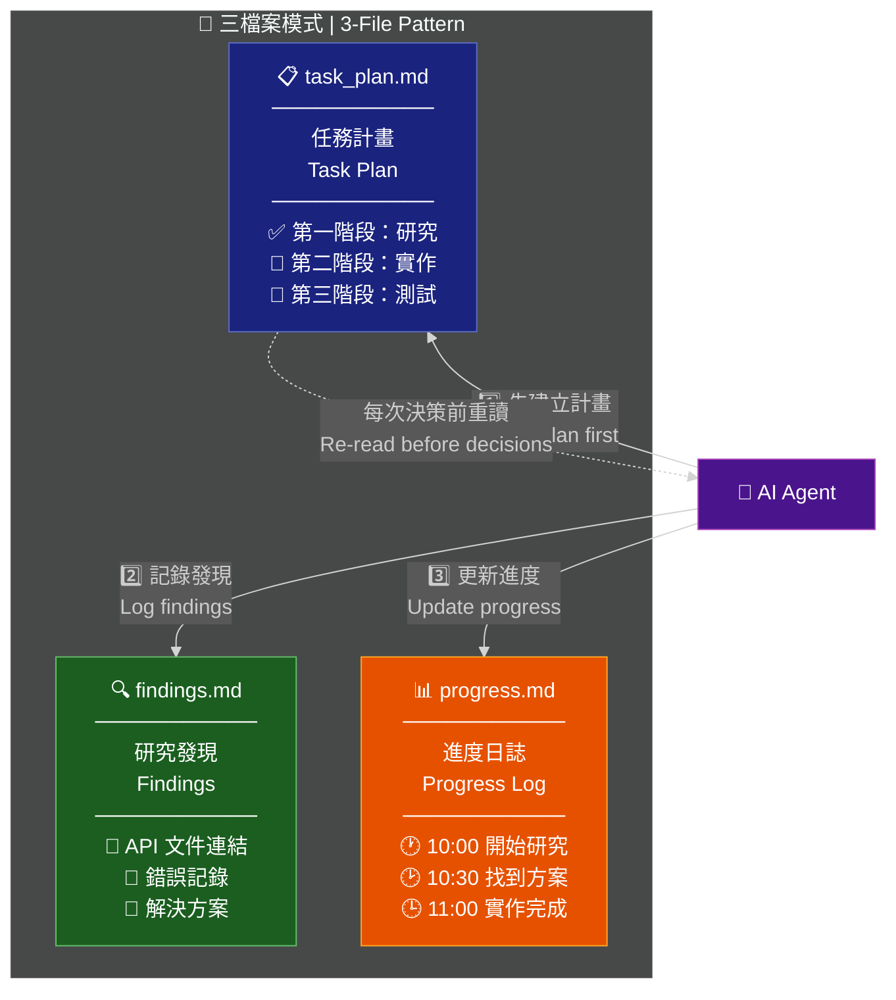
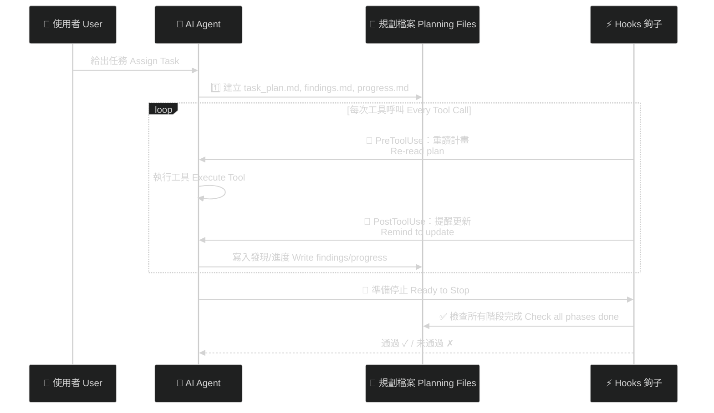
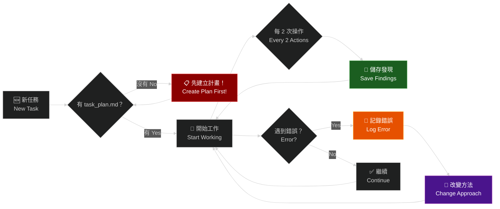
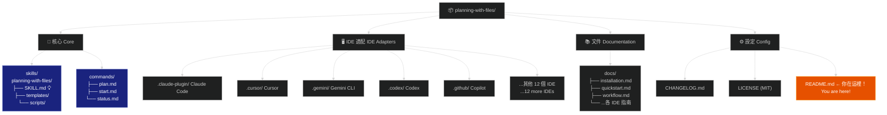

# Planning with Files | 用檔案做規劃

> **Work like Manus** — the AI agent company Meta acquired for **$2 billion**.
>
> **像 Manus 一樣工作** — 這家 AI agent 公司被 Meta 以 **20 億美元**收購。

[](https://github.com/OthmanAdi/planning-with-files/issues?q=is%3Aissue+is%3Aclosed)
[](https://github.com/OthmanAdi/planning-with-files/pulls?q=is%3Apr+is%3Aclosed)
[](docs/evals.md)
[](docs/evals.md)
[](docs/evals.md)

---

## 一句話說明 | What is this?

> 這是一個 Claude Code 外掛，讓你的 AI agent 不再「金魚腦」——它會把計畫、發現和進度寫進檔案，就像人類工程師用筆記本一樣。
>
> A Claude Code plugin that gives your AI agent a "notebook" — it writes plans, findings, and progress to files so nothing gets lost when context resets.



---

<details>
<summary><strong>💬 A Note from the Author | 作者的話</strong></summary>

To everyone who starred, forked, and shared this skill — thank you. This project blew up in less than 24 hours, and the support from the community has been incredible.

感謝每一位按星號、Fork 和分享的人。這個專案在不到 24 小時內就爆紅了，社群的支持令人難以置信。

If this skill helps you work smarter, that's all I wanted.

如果這個技能讓你工作更聰明，那就是我想要的。

</details>

<details open>
<summary><strong>🌍 See What the Community Built</strong></summary>

| Fork | Author | Features |
|------|--------|----------|
| [devis](https://github.com/st01cs/devis) | [@st01cs](https://github.com/st01cs) | Interview-first workflow, `/devis:intv` and `/devis:impl` commands, guaranteed activation |
| [multi-manus-planning](https://github.com/kmichels/multi-manus-planning) | [@kmichels](https://github.com/kmichels) | Multi-project support, SessionStart git sync |
| [plan-cascade](https://github.com/Taoidle/plan-cascade) | [@Taoidle](https://github.com/Taoidle) | Multi-level task orchestration, parallel execution, multi-agent collaboration |
| [agentfund-skill](https://github.com/RioTheGreat-ai/agentfund-skill) | [@RioTheGreat-ai](https://github.com/RioTheGreat-ai) | Crowdfunding for AI agents with milestone-based escrow on Base |

*Built something? [Open an issue](https://github.com/OthmanAdi/planning-with-files/issues) to get listed!*

</details>

<details>
<summary><strong>🤝 Contributors</strong></summary>

See the full list of everyone who made this project better in [CONTRIBUTORS.md](./CONTRIBUTORS.md).

</details>

<details>
<summary><strong>📦 Releases & Session Recovery</strong></summary>

### Current Version: v2.18.2

| Version | Highlights |
|---------|------------|
| **v2.18.2** | Mastra Code hooks fix (hooks.json + docs accuracy) |
| **v2.18.1** | Copilot garbled characters complete fix |
| **v2.18.0** | BoxLite sandbox runtime integration |
| **v2.17.0** | Mastra Code support + all IDE SKILL.md spec fixes |
| **v2.16.1** | Copilot garbled characters fix — PS1 UTF-8 encoding + bash ensure_ascii (thanks @Hexiaopi!) |
| **v2.16.0** | GitHub Copilot hooks support (thanks @lincolnwan!) |
| **v2.15.1** | Session catchup false-positive fix (thanks @gydx6!) |
| **v2.15.0** | `/plan:status` command, OpenCode compatibility fix |
| **v2.14.0** | Pi Agent support, OpenClaw docs update, Codex path fix |
| **v2.11.0** | `/plan` command for easier autocomplete |
| **v2.10.0** | Kiro steering files support |
| **v2.7.0** | Gemini CLI support |
| **v2.2.0** | Session recovery, Windows PowerShell, OS-aware hooks |

[View all releases](https://github.com/OthmanAdi/planning-with-files/releases) · [CHANGELOG](CHANGELOG.md)

> 🧪 **Experimental:** Isolated parallel planning (`.planning/{uuid}/` folders) is being tested on [`experimental/isolated-planning`](https://github.com/OthmanAdi/planning-with-files/tree/experimental/isolated-planning). Try it and share feedback!

---

### Session Recovery

When your context fills up and you run `/clear`, this skill **automatically recovers** your previous session.

**How it works:**
1. Checks for previous session data in `~/.claude/projects/`
2. Finds when planning files were last updated
3. Extracts conversation that happened after (potentially lost context)
4. Shows a catchup report so you can sync

**Pro tip:** Disable auto-compact to maximize context before clearing:
```json
{ "autoCompact": false }
```

</details>

<details>
<summary><strong>🛠️ Supported IDEs (16 Platforms)</strong></summary>

| IDE | Status | Installation Guide | Format |
|-----|--------|-------------------|--------|
| Claude Code | ✅ Full Support | [Installation](docs/installation.md) | Plugin + SKILL.md |
| Gemini CLI | ✅ Full Support | [Gemini Setup](docs/gemini.md) | Agent Skills |
| OpenClaw | ✅ Full Support | [OpenClaw Setup](docs/openclaw.md) | Workspace/Local Skills |
| Kiro | ✅ Full Support | [Kiro Setup](docs/kiro.md) | Steering Files |
| Cursor | ✅ Full Support | [Cursor Setup](docs/cursor.md) | Skills + Hooks |
| Continue | ✅ Full Support | [Continue Setup](docs/continue.md) | Skills + Prompt files |
| Kilocode | ✅ Full Support | [Kilocode Setup](docs/kilocode.md) | Skills |
| OpenCode | ⚠️ Partial Support | [OpenCode Setup](docs/opencode.md) | Personal/Project Skill (session catchup limited) |
| Codex | ✅ Full Support | [Codex Setup](docs/codex.md) | Personal Skill |
| FactoryAI Droid | ✅ Full Support | [Factory Setup](docs/factory.md) | Workspace/Personal Skill |
| Antigravity | ✅ Full Support | [Antigravity Setup](docs/antigravity.md) | Workspace/Personal Skill |
| CodeBuddy | ✅ Full Support | [CodeBuddy Setup](docs/codebuddy.md) | Workspace/Personal Skill |
| AdaL CLI (Sylph AI) | ✅ Full Support | [AdaL Setup](docs/adal.md) | Personal/Project Skills |
| Pi Agent | ✅ Full Support | [Pi Agent Setup](docs/pi-agent.md) | Agent Skills |
| GitHub Copilot | ✅ Full Support | [Copilot Setup](docs/copilot.md) | Hooks |
| Mastra Code | ✅ Full Support | [Mastra Setup](docs/mastra.md) | Skills + Hooks |

> **Note:** If your IDE uses the legacy Rules system instead of Skills, see the [`legacy-rules-support`](https://github.com/OthmanAdi/planning-with-files/tree/legacy-rules-support) branch.

</details>

<details>
<summary><strong>🧱 Sandbox Runtimes (1 Platform)</strong></summary>

| Runtime | Status | Guide | Notes |
|---------|--------|-------|-------|
| BoxLite | ✅ Documented | [BoxLite Setup](docs/boxlite.md) | Run Claude Code + planning-with-files inside hardware-isolated micro-VMs |

> **Note:** BoxLite is a sandbox runtime, not an IDE. Skills load via [ClaudeBox](https://github.com/boxlite-ai/claudebox) — BoxLite’s official Claude Code integration layer.

</details>

---

A Claude Code plugin that transforms your workflow to use persistent markdown files for planning, progress tracking, and knowledge storage — the exact pattern that made Manus worth billions.

一個 Claude Code 外掛，將你的工作流程轉變為使用持久的 Markdown 檔案進行規劃、進度追蹤和知識儲存——正是這個模式讓 Manus 價值數十億美元。

[](https://opensource.org/licenses/MIT)
[](https://code.claude.com/docs/en/plugins)
[](https://code.claude.com/docs/en/skills)
[](https://docs.cursor.com/context/skills)
[](https://kilo.ai/docs/agent-behavior/skills)
[](https://geminicli.com/docs/cli/skills/)
[](https://openclaw.ai)
[](https://kiro.dev/docs/cli/steering/)
[](https://docs.sylph.ai/features/plugins-and-skills)
[](https://pi.dev)
[](https://docs.github.com/en/copilot/reference/hooks-configuration)
[](https://code.mastra.ai)
[](https://boxlite.ai)
[](https://github.com/OthmanAdi/planning-with-files/releases)
[](https://getskillcheck.com)

## Quick Install | 快速安裝

```bash
npx skills add OthmanAdi/planning-with-files --skill planning-with-files -g
```

Works with Claude Code, Cursor, Codex, Gemini CLI, and 40+ agents supporting the [Agent Skills](https://agentskills.io) spec.

支援 Claude Code、Cursor、Codex、Gemini CLI 及 40+ 個相容 [Agent Skills](https://agentskills.io) 規範的 AI agent。

<details>
<summary><strong>🔧 Claude Code Plugin (Advanced Features)</strong></summary>

For Claude Code-specific features like `/plan` autocomplete commands:

```
/plugin marketplace add OthmanAdi/planning-with-files
/plugin install planning-with-files@planning-with-files
```

</details>

That's it! Now use one of these commands in Claude Code:

| Command | Autocomplete | Description |
|---------|--------------|-------------|
| `/planning-with-files:plan` | Type `/plan` | Start planning session (v2.11.0+) |
| `/planning-with-files:status` | Type `/plan:status` | Show planning progress at a glance (v2.15.0+) |
| `/planning-with-files:start` | Type `/planning` | Original start command |

**Alternative:** If you want `/planning-with-files` (without prefix), copy skills to your local folder:

**macOS/Linux:**
```bash
cp -r ~/.claude/plugins/cache/planning-with-files/planning-with-files/*/skills/planning-with-files ~/.claude/skills/
```

**Windows (PowerShell):**
```powershell
Copy-Item -Recurse -Path "$env:USERPROFILE\.claude\plugins\cache\planning-with-files\planning-with-files\*\skills\planning-with-files" -Destination "$env:USERPROFILE\.claude\skills\"
```

See [docs/installation.md](docs/installation.md) for all installation methods.

## Why This Skill? | 為什麼需要這個技能？

On December 29, 2025, [Meta acquired Manus for $2 billion](https://techcrunch.com/2025/12/29/meta-just-bought-manus-an-ai-startup-everyone-has-been-talking-about/). In just 8 months, Manus went from launch to $100M+ revenue. Their secret? **Context engineering**.

2025 年 12 月 29 日，[Meta 以 20 億美元收購了 Manus](https://techcrunch.com/2025/12/29/meta-just-bought-manus-an-ai-startup-everyone-has-been-talking-about/)。短短 8 個月，Manus 就從推出到營收超過 1 億美元。他們的秘密？**上下文工程（Context Engineering）**。

> "Markdown is my 'working memory' on disk. Since I process information iteratively and my active context has limits, Markdown files serve as scratch pads for notes, checkpoints for progress, building blocks for final deliverables."
> — Manus AI
>
> 「Markdown 是我在磁碟上的『工作記憶』。由於我迭代處理資訊，而主動上下文有限制，Markdown 檔案充當筆記的草稿紙、進度的檢查點、最終成果的基礎模組。」
> — Manus AI

## The Problem | 問題是什麼？

Claude Code (and most AI agents) suffer from:

Claude Code（以及大多數 AI agent）面臨以下問題：

- **Volatile memory | 記憶易失** — TodoWrite tool disappears on context reset（上下文重置後 TodoWrite 工具就消失了）
- **Goal drift | 目標漂移** — After 50+ tool calls, original goals get forgotten（超過 50 次工具呼叫後，原始目標被遺忘）
- **Hidden errors | 錯誤隱藏** — Failures aren't tracked, so the same mistakes repeat（失敗沒被追蹤，導致同樣的錯誤一再重複）
- **Context stuffing | 上下文塞爆** — Everything crammed into context instead of stored（所有東西都塞進上下文，而不是儲存到檔案）

```mermaid
%%{init: {'theme': 'dark'}}%%
graph TD
    subgraph problem ["❌ 沒有這個技能時 | Without This Skill"]
        P1["🔄 第 1 次工具呼叫<br/>Tool Call #1"] --> P2["🔄 第 20 次<br/>#20"]
        P2 --> P3["🔄 第 50 次<br/>#50"]
        P3 --> P4["😵 目標遺忘！<br/>Goal Forgotten!"]
        P3 --> P5["🔁 重複同樣的錯誤<br/>Same Errors Repeat"]
        P3 --> P6["💥 上下文爆了<br/>Context Overflow"]
    end

    subgraph solution ["✅ 有這個技能時 | With This Skill"]
        S1["🔄 第 1 次工具呼叫<br/>Tool Call #1"] --> S2["🔄 第 20 次<br/>#20"]
        S2 --> S3["🔄 第 50 次<br/>#50"]
        S3 --> S4["🎯 目標清晰！<br/>Goal Clear!"]
        S2 -.->|"📝 寫入檔案<br/>Save to file"| SF["💾 planning files"]
        S3 -.->|"📖 重讀計畫<br/>Re-read plan"| SF
    end

    style problem fill:#1a0000,stroke:#ff6b6b
    style solution fill:#001a00,stroke:#90ee90
    style P4 fill:#8b0000,stroke:#ff6b6b,color:#fff
    style P5 fill:#8b0000,stroke:#ff6b6b,color:#fff
    style P6 fill:#8b0000,stroke:#ff6b6b,color:#fff
    style S4 fill:#006400,stroke:#90ee90,color:#fff
    style SF fill:#004d00,stroke:#90ee90,color:#fff
```



## The Solution: 3-File Pattern | 解決方案：三檔案模式

> **核心概念：** 每個複雜任務，建立三個檔案。就像工程師的筆記本分成「計畫」、「研究筆記」和「工作日誌」三本。
>
> **Core Concept:** For every complex task, create THREE files — like an engineer's notebooks split into "plan", "research notes", and "work log".

```
task_plan.md      → Track phases and progress     → 追蹤階段與進度
findings.md       → Store research and findings    → 儲存研究與發現
progress.md       → Session log and test results   → 工作日誌與測試結果
```



### The Core Principle | 核心原則

```
Context Window = RAM (volatile, limited)     上下文窗口 ＝ RAM（易失、有限）
Filesystem = Disk (persistent, unlimited)    檔案系統 ＝ 硬碟（持久、無限）

→ Anything important gets written to disk.
→ 任何重要的東西都要寫入硬碟。
```

## The Manus Principles | Manus 原則

| Principle 原則 | Implementation 實作方式 |
|-----------|----------------|
| Filesystem as memory 檔案即記憶 | Store in files, not context 存在檔案裡，不是上下文 |
| Attention manipulation 注意力操控 | Re-read plan before decisions 決策前重讀計畫（透過 hooks） |
| Error persistence 錯誤持久化 | Log failures in plan file 在計畫檔中記錄失敗 |
| Goal tracking 目標追蹤 | Checkboxes show progress 勾選框顯示進度 |
| Completion verification 完成驗證 | Stop hook checks all phases 停止鉤子檢查所有階段 |

## Usage | 使用方式

Once installed, the AI agent will:

安裝完成後，AI agent 會：

1. **Ask for your task** if no description is provided — **詢問你的任務**（如果沒有提供描述）
2. **Create `task_plan.md`, `findings.md`, and `progress.md`** in your project directory — **建立三個規劃檔案**到你的專案目錄
3. **Re-read plan** before major decisions (via PreToolUse hook) — **決策前重讀計畫**（透過 PreToolUse 鉤子）
4. **Remind you** to update status after file writes (via PostToolUse hook) — **提醒你更新狀態**（透過 PostToolUse 鉤子）
5. **Store findings** in `findings.md` instead of stuffing context — **儲存發現**到 `findings.md`，而非塞入上下文
6. **Log errors** for future reference — **記錄錯誤**以供未來參考
7. **Verify completion** before stopping (via Stop hook) — **驗證完成度**後才停止（透過 Stop 鉤子）



Invoke with | 呼叫方式：
- `/planning-with-files:plan` - Type `/plan` to find in autocomplete (v2.11.0+) — 輸入 `/plan` 即可自動完成
- `/planning-with-files:start` - Type `/planning` to find in autocomplete — 輸入 `/planning` 即可自動完成
- `/planning-with-files` - Only if you copied skills to `~/.claude/skills/` — 僅限將技能複製到 `~/.claude/skills/` 時

See [docs/quickstart.md](docs/quickstart.md) for the full 5-step guide. | 完整 5 步指南請見 [docs/quickstart.md](docs/quickstart.md)。

## Benchmark Results | 基準測試結果

Formally evaluated using Anthropic's [skill-creator](https://github.com/anthropics/skills/tree/main/skills/skill-creator) framework (v2.22.0). 10 parallel subagents, 5 task types, 30 objectively verifiable assertions, 3 blind A/B comparisons.

使用 Anthropic 官方 [skill-creator](https://github.com/anthropics/skills/tree/main/skills/skill-creator) 框架正式評測（v2.22.0）。10 個平行子代理、5 種任務類型、30 個客觀可驗證的斷言、3 次盲測 A/B 比較。

| Test 測試項目 | with_skill 有技能 | without_skill 無技能 |
|------|-----------|---------------|
| Pass rate 通過率 (30 assertions) | **96.7%** (29/30) | 6.7% (2/30) |
| 3-file pattern followed 遵循三檔案模式 | 5/5 evals | 0/5 evals |
| Blind A/B wins 盲測勝出 | **3/3 (100%)** | 0/3 |
| Avg rubric score 平均評分 | **10.0/10** | 6.8/10 |

```mermaid
%%{init: {'theme': 'dark'}}%%
xychart-beta
    title "技能效果對比 | Skill Effectiveness Comparison"
    x-axis ["通過率 Pass Rate", "三檔案遵循 3-File", "盲測勝率 A/B Wins", "平均分 Avg Score"]
    y-axis "百分比 Percentage (%)" 0 --> 100
    bar [96.7, 100, 100, 100]
    bar [6.7, 0, 0, 68]
```



[Full methodology and results](docs/evals.md) · [Technical write-up](docs/article.md)

完整方法論與結果請見 [docs/evals.md](docs/evals.md) · 技術文章 [docs/article.md](docs/article.md)

## Key Rules | 關鍵規則

1. **Create Plan First | 先建計畫** — Never start without `task_plan.md`（永遠不要在沒有 `task_plan.md` 的情況下開始）
2. **The 2-Action Rule | 兩動作規則** — Save findings after every 2 view/browser operations（每 2 次瀏覽/操作後就儲存發現）
3. **Log ALL Errors | 記錄所有錯誤** — They help avoid repetition（幫助避免重蹈覆轍）
4. **Never Repeat Failures | 絕不重複失敗** — Track attempts, mutate approach（追蹤嘗試次數，改變方法）



## When to Use | 何時使用

**Use this pattern for | 適合使用：**
- Multi-step tasks (3+ steps) — 多步驟任務（3 步以上）
- Research tasks — 研究型任務
- Building/creating projects — 建構／創建專案
- Tasks spanning many tool calls — 涉及大量工具呼叫的任務

**Skip for | 不需要使用：**
- Simple questions — 簡單問題
- Single-file edits — 單一檔案編輯
- Quick lookups — 快速查詢

## File Structure | 檔案結構

> **初學者提示：** 你不需要理解所有資料夾！核心是 `skills/planning-with-files/` 裡的 `SKILL.md`，其他 `.xxx/` 資料夾是不同 IDE 的適配。
>
> **Beginner Tip:** You don't need to understand every folder! The core is `SKILL.md` in `skills/planning-with-files/`. The `.xxx/` folders are adaptations for different IDEs.



<details>
<summary><strong>📂 完整檔案樹 | Full File Tree</strong></summary>

```
planning-with-files/
├── commands/                # 外掛指令 Plugin commands
│   ├── plan.md              # /planning-with-files:plan 指令 (v2.11.0+)
│   └── start.md             # /planning-with-files:start 指令
├── templates/               # 根層模板 Root-level templates
├── scripts/                 # 根層腳本 Root-level scripts
├── docs/                    # 說明文件 Documentation
│   ├── installation.md      # 安裝指南
│   ├── quickstart.md        # 快速入門
│   ├── workflow.md          # 工作流程
│   ├── troubleshooting.md   # 疑難排解
│   ├── gemini.md            # Gemini CLI 設定
│   ├── cursor.md            # Cursor 設定
│   ├── windows.md           # Windows 設定
│   ├── kilocode.md          # Kilocode 設定
│   ├── codex.md             # Codex 設定
│   ├── opencode.md          # OpenCode 設定
│   ├── mastra.md            # Mastra Code 設定
│   └── boxlite.md           # BoxLite 沙盒設定
├── examples/                # 整合範例 Integration examples
│   └── boxlite/             # BoxLite 快速入門
├── skills/                  # 技能資料夾 Skill folder
│   └── planning-with-files/
│       ├── SKILL.md          # ⭐ 核心技能定義 Core skill definition
│       ├── examples.md
│       ├── reference.md
│       ├── templates/        # 📋 三個檔案模板 3-file templates
│       └── scripts/          # ⚡ Hook 腳本 Hook scripts
├── .cursor/                 # Cursor 適配 (skills + hooks)
├── .gemini/                 # Gemini CLI 適配
├── .codex/                  # Codex 適配
├── .opencode/               # OpenCode 適配
├── .kilocode/               # Kilo Code 適配
├── .openclaw/               # OpenClaw 適配
├── .adal/                   # AdaL CLI / Sylph AI 適配
├── .pi/                     # Pi Agent 適配
├── .github/                 # GitHub Copilot hooks
├── .mastracode/             # Mastra Code 適配
├── .claude-plugin/          # Claude Code 外掛清單
├── CHANGELOG.md             # 更新日誌
├── LICENSE                  # MIT 授權
└── README.md                # 本文件 This file
```

</details>

## Documentation | 說明文件

All platform setup guides and documentation are in the [docs/](./docs/) folder.

所有平台設定指南與文件都在 [docs/](./docs/) 資料夾中。

## Acknowledgments | 致謝

- **Manus AI** — For pioneering context engineering patterns（開創上下文工程模式的先驅）
- **Anthropic** — For Claude Code, Agent Skills, and the Plugin system（Claude Code、Agent Skills 和外掛系統）
- **Lance Martin** — For the detailed Manus architecture analysis（詳細的 Manus 架構分析）
- Based on [Context Engineering for AI Agents](https://manus.im/blog/Context-Engineering-for-AI-Agents-Lessons-from-Building-Manus)（基於 Manus 的上下文工程文章）

## Contributing | 貢獻

Contributions welcome! 歡迎貢獻！

1. Fork the repository — Fork 這個倉庫
2. Create a feature branch — 建立功能分支
3. Submit a pull request — 提交 Pull Request

## License | 授權

MIT License — feel free to use, modify, and distribute.

MIT 授權 — 自由使用、修改和散布。

---

**Author | 作者：** [Ahmad Othman Ammar Adi](https://github.com/OthmanAdi)

**正體中文翻譯 Traditional Chinese Translation：** 社群貢獻 Community Contribution

## Star History

<a href="https://repostars.dev/?repos=OthmanAdi%2Fplanning-with-files&theme=copper"></a>
